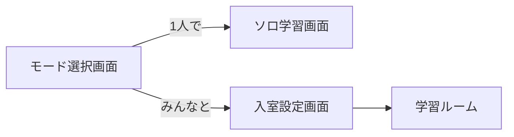

# 📚 StudySync

**StudySync**は、孤独な学習環境における「モチベーション維持」の課題を解決するためのReact製Webアプリケーションです。
リアルタイムで他者の学習状況を可視化することで、「一人ではない」という一体感を生み出し、学習の継続を強力にサポートします。

---

## 🦄 ユニーク性
「登録不要・URL共有で即参加」の手軽さと、秒単位のリアルタイム同期による「今、共に頑張っている」という強い一体感が特徴。複雑な機能より、瞬時のつながり体験に特化しています。

---

## 🏗️ システム構成図

<p align="left">
  
</p>

---

## 📱 画面構成と機能

### 画面遷移フロー


### 画面構成


### 要件定義
#### 機能要件
- **リアルタイムタイマー**: 参加者全員の勉強時間を秒単位で同期
- **チャット機能**: 励まし合いや情報交換のためのチャット（履歴保存あり）
- **入退室管理**: 参加者の増減をリアルタイムでリスト表示
- **グラフ表示**: 勉強時間の推移を可視化
- **一時退出**: データを保持したまま一時的にルームを離れる機能

#### 非機能要件
- **レスポンス性**: Socket.ioによる低遅延な双方向通信
- **データ永続化**: LocalStorageを活用した簡易的なデータ保護（リロード対策）

---

## ⚙ 技術スタック

- **フロントエンド**: React, Chart.js, Socket.io-client, QRCode.react, CSS
- **バックエンド**: Node.js, Express, Socket.io
- **サーバー**: Vercel, Render

---

## 🔗 関連リンク

- **FigJam (設計メモ)**: (https://www.figma.com/board/drcksRqjjFtiHAN6ZPV2nj/4%E5%B9%B4%E3%83%81%E3%83%BC%E3%83%A02%EF%BC%9A-%E6%B0%B8%E7%94%B0--%E4%B8%8A%E7%94%B2--%E5%AF%8C%E6%9D%BE-?node-id=0-1&t=GPmVAWuDFNGA28Z2)

---

## 🚀 使い方

1. 「勉強スタート ▶️」ボタンをクリックしてセッション開始
2. 勉強中はタイマーが進行し、メモを自由に記入可能
3. 「セッション終了」ボタンで記録を保存
4. 勉強時間の推移はグラフで確認可能
5. 過去のログは一覧で表示され、振り返りに便利
6. URLを共有することで、友人とルームで一緒に勉強可能

---

## 🧮 レベルと称号

| 累計時間（分） | レベル | 称号 |
|---|---|---|
| 0〜599 | Lv.1 | 初心者 |
| 600〜1799 | Lv.2 | 継続王 |
| 1800〜3599 | Lv.3 | 集中マスター |
| 3600〜7199 | Lv.4 | 勉強仙人 |
| 7200以上 | Lv.5 | 知識賢者 |

---

## 📦 インストールと起動

```bash
git clone https://github.com/akaihito/2nd_Exercise
cd 2nd_Exercise/
npm install
必要な人は以下のコードも実行
(npm install -D chart.js react-chartjs-2)
npm start
```